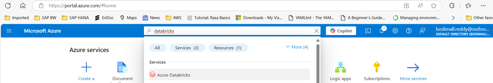
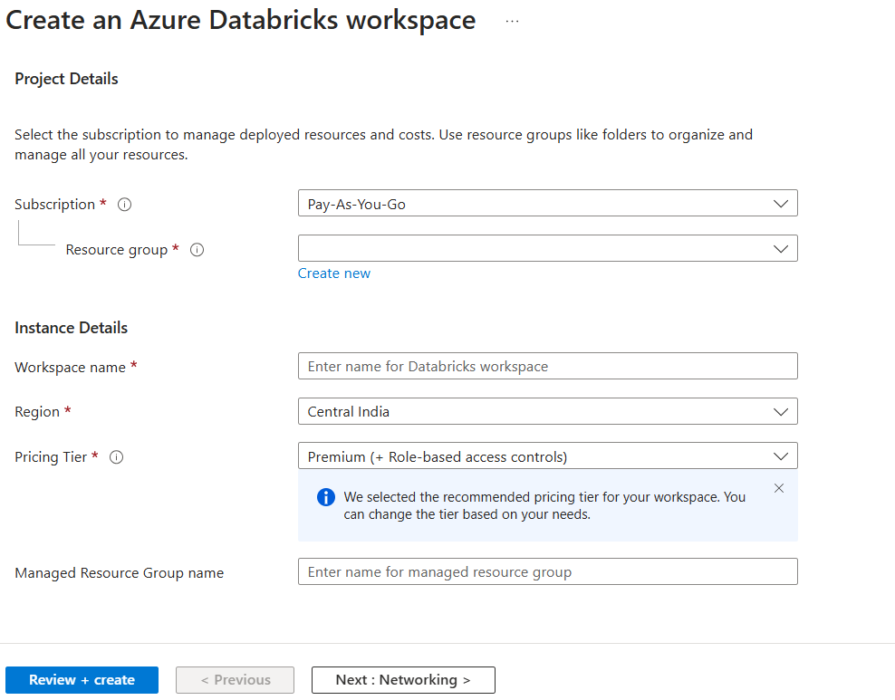
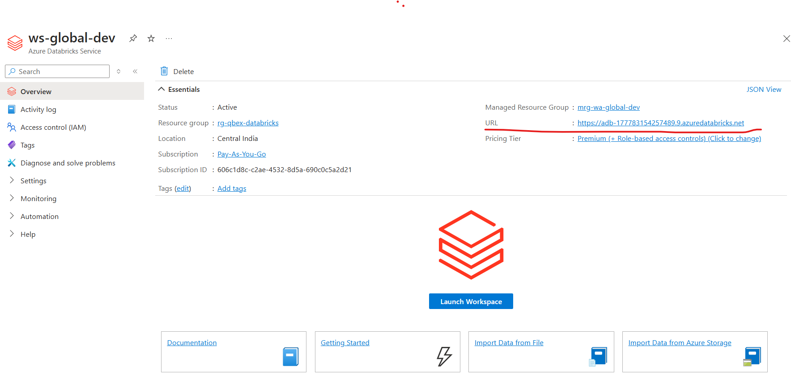

# How to Create Azure Databricks Workspace

### 1. Create a User with Custom Domain

### 2. Assign the Role "Global Administrator"

### 3. Login to https://portal.azure.com/ with Newly craeted User

### 4. Search for Resource Databricks

!

### 5. Fill in the necessary Details

### 6. Click Create

### 7. Once the Databricks resource is created you can see the below screen

  
