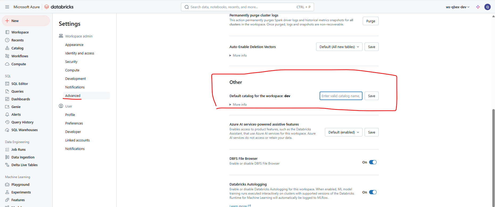

# Create your First Table and Grant Permission

``` sql
select current_catalog()
```

### How to set the default catalog



<br></br>

```sql
use catalog <catalog-name>;
```

```sql
show schemas in ws_qbex_dev;
```

```sql
create table <catalog-name>.default.employee
(
emp_id int,
emp_name string,
emp_dept string,
emp_salary decimal(10,2)
)
```

```sql
insert into <catalog-name>.default.employee
values (1,'Pratap','IT',50000.00),
       (2,'Chand','HR',70000.00)
```

```sql
select * from <catalog-name>.default.employee;
```
```sql
GRANT SELECT ON <catalog-name>.default.employee TO `dashboard_users`;
```